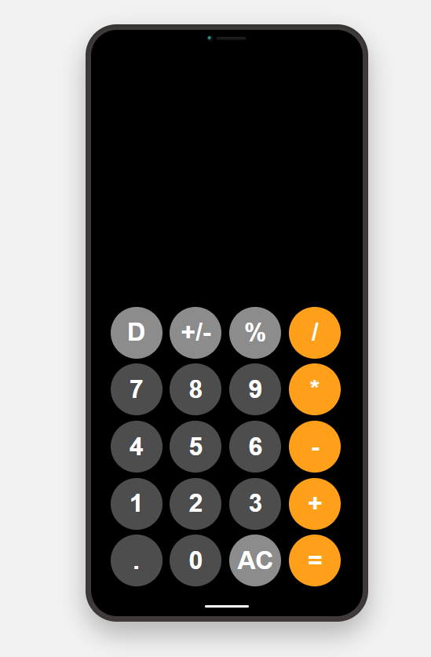

# 🧮 Simple Web Calculator

> A minimal, responsive calculator built with **HTML + CSS + JavaScript** — a beginner-friendly project to practice web front-end development.



---

## ✨ 项目简介

这是一个使用 **HTML、CSS、JavaScript** 编写的简易网页计算器。

主要用于练习网页前端开发的基础技能，包括：

- 页面结构设计（HTML）
- 样式布局与美化（CSS）
- 按钮事件与交互逻辑（JavaScript）

该项目模仿 iPhone 计算器的布局风格，支持基础四则运算和简单的输入校验逻辑。

---

## 🔧 功能特性

- ➕ 加、➖ 减、✖ 乘、➗ 除 运算
- 🔹 小数点与符号 ± 切换
- 🧮 百分比运算（%）
- 🧼 清空输入（AC）
- 💡 错误输入提示与自动处理
- 📱 响应式布局（适配不同屏幕）

---

## 📁 项目结构

```
calculator/
│
├── index.html          # 页面结构
├── styles.css          # 样式设计（含 iPhone 外框）
├── index.js            # 逻辑交互脚本
└── favicon.png         # 网页图标
```

---

## 🚀 本地运行

1. **克隆项目**

   ```bash:disable-run
   git clone https://github.com/Tomzying/calculator.git
   cd calculator
   ```

2. **直接打开页面**

   在浏览器中双击打开 `index.html` 即可使用。

---

## 🧩 技术栈

| 技术                  | 用途             |
|-----------------------|------------------|
| HTML5                 | 页面结构         |
| CSS3 (Grid + Flexbox) | 布局与样式设计   |
| JavaScript (ES6)      | 事件交互与逻辑控制 |
| Git & GitHub          | 版本管理与项目托管 |

---